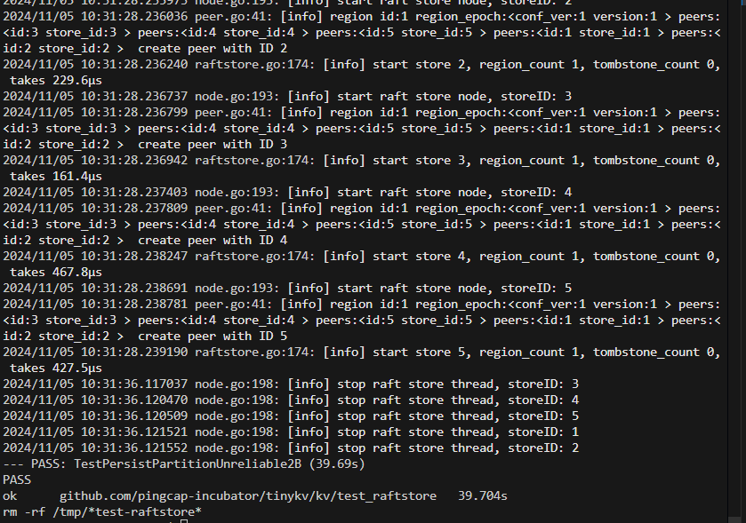

1
badger是dgraph开源的LSMTree的KV引擎。
对storage.go中的接口进行编写即可，调用已知的方法。此外，还需要撰写raw_api.go实现对storage.go中方法的调用。

难点

1.对go语言刚上手不熟悉(可能需要更多时间)

2.对于一些接口调用（badgerdb）可能需要查询（理清代码的框架）

make project1
project1通过

raft算法（2A）

raft算法和paxos算法对比

多数派原则，系统的决断无需全员参与，多数派达成了共识即可视为整个系统的答复。

一主多从，raft算法下，系统的节点分为领导者leader和follower两类角色。

复制状态机：相同的初始状态+相同的输入=相同的结束状态；即client给leader发送命令，leader把命令加入到log中，follower之后执行log中的内容。

leader选举：
-没有leader的情况下，会重新选举（半数原则）

安全性：

rpc协议：
golang中有已有的rpc框架，进行调用。

日志表
日志表的结构

日志表是暂存storage的结构

https://www.codedump.info/post/20180922-etcd-raft/

HardState contains the state of a node need to be peristed, including the current term, commit index
HardState包含了需要持久化的节点信息，包括了当前任期以及提交的编号
ConfState contains the current membership information of the raft group
ConfState包含了

2a
step是一个处理函数，对于不同种类的message进行处理；
同时对于不同类别的节点，有着不同种类的处理方式。
调用tick，需要对各类计数器+1，如果超过计时阈值，则需要按照raft算法所说的那样，
进行不同的节点选举。
对于不同的message，它们共用一个结构。所以对于不同的信息，有些字段可能为空。
分别对于不同的message进行代码的撰写。

测试的时候可以用vscode本地自带的测试功能，比较方便。此外还可以打debug标记来进行测试。

2a测试

此处是index超过了下标，需要进一步排查
调用golang的log库进行调用

debug出是减了负下标

改为

startelection的错误

少了非

这里任期应该是小于等于

可持久化的问题

project 4
primary key(主键)
primary key是从写入的key中随机选的,如果primary key执行成功,其他的
key都可以并发执行;如果primary key执行失败,其他的key就不能执行了.

Data：实际的数据，存在多版本，版本号就是写入事务的 startTs。 Lock：锁标记，版本号就是写入事务的 startTs，同时每一个 lock 上含有 primary key 的值。 Write：Write 上存在 startTs 和 commitTs，startTs 是指向对应 Data 中的版本，commitTs 是这个 Write 的创建时间。

三个CF分别操作，对于不同的CF进行操作；时间戳的判断，如果写的时间戳小于当前时间戳，说明该写无效。

脏读（Dirty Read）

脏读发生在一个事务读取了另一个事务未提交的数据。例如，事务A读取了一个数据项，此时事务B对该数据项进行了修改并提交。如果事务A再次读取同一个数据项，它将得到不同的结果，这就是脏读。脏读可以通过将事务隔离级别设置为**读已提交（READ COMMITTED）**来避免。

不可重复读（Non-Repeatable Read）

不可重复读是指在同一事务中，多次读取同一数据集合时，由于其他事务的修改，后续的读取可能会得到不同的结果。这通常是由于其他事务对数据进行了更新操作。不可重复读可以通过将事务隔离级别设置为**可重复读（REPEATABLE READ）**来避免。

幻读（Phantom Read）

幻读与不可重复读类似，但它是指在同一事务中执行相同的查询时，由于其他事务插入了新的行，导致后续的查询返回了额外的行。幻读主要与插入操作有关。要避免幻读，可以将事务隔离级别设置为串行化（SERIALIZABLE），这是最严格的隔离级别，但可能会导致性能问题。

4a通过

prewrite
1.检查写入的key是否存在大于startts的write,存在就abort。说明在你的事务开启后，已经存在写入并且提交。
2.检查是否存在lock（任意时间戳），如果有上锁的数据，那么直接abort
3.如果通过上述两个检查，则进行写入操作。

任意时间戳的原因：(?)
Lock 的 startTs 小于当前事务的 startTs：如果你读了，就会产生脏读，因为前一个事务都没有 commit 你就读了。

Lock 的 startTs 大于当前事务的 startTs：如果你读了并修改了然后提交，拥有这个 lock 的事务会产生不可重复读。

Lock 的 startTs 等于当前事务的 startTs：不可能发生，因为当你重启事务之后，是分配一个新的 startTs，你不可能使用一个过去的 startTs 去执行重试操作。

4b ok

4c

未及时delete导致expired的数据未及时删除

此处startts错了

改为

4c通过

2b:

    Store：每一个节点叫做一个 store，也就是一个节点上面只有一个 Store。代码里面叫 RaftStore，后面统一使用 RaftStore 代称。
    Peer：一个 RaftStore 里面会包含多个 peer，一个 RaftStore 里面的所有 peer 公用同一个底层存储，也就是多个 peer 公用同一个 badger 实例。
    Region：一个 Region 叫做一个 Raft group，一个 region 包含多个 peer，这些 peer 散落在不同的 RaftStore 上。Region 处理的是某一个范围的数据。比如 Region A 处理 0 < k e y < s p l i t ，Region B 处理 s p l i t ≤ k e y < M A X ，两个 Region 各司其职，互不干涉，均有自己的 Leader。

    注意：一个 Region 在一个 RaftStore 上最多只有一个 peer，因为一个 region 里面所有 peer 的数据是一致的，如果在同一个 RaftStore 上面有两个一样的 peer，就毫无意义，并不能增加容灾性。

该项目的架构如下：
client <-> peer <-> raftstore <-> store

2b中有并发的测试集，可能需要通过修改2a或者更前面的内容来通过测试集。
未测试transferleader的那部分

有部分更改涉及到2a的修改 （（之前的一些代码还要改

2b通过

     

project2c 在 project2b 的基础上完成集群的快照功能。分为五个部分：快照生成，快照分发，快照接收，快照应用，日志压缩。
 1. 快照生成：在leader节点上，通过快照生成函数生成快照，并将快照发送给follower节点。
 2. 快照分发：在follower节点上，通过快照分发函数接收快照，并将快照发送给leader节点。

2c通过
